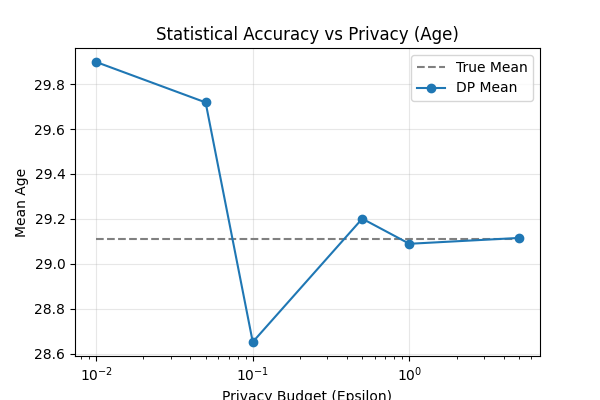
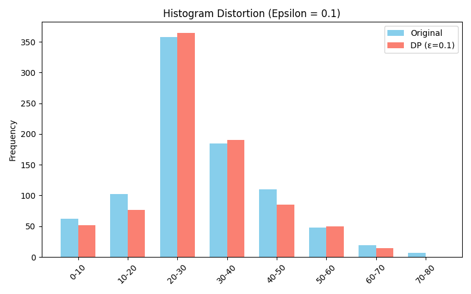
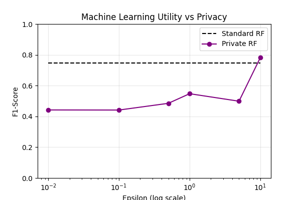

# Differential Privacy Toolkit

A practical implementation demonstrating the privacy-utility tradeoff in statistical analysis and machine learning using the Titanic dataset.

## Overview

This toolkit provides a unified interface for experimenting with differential privacy across two domains:
- **Statistical Analysis**: Mean calculations, histograms, and aggregate queries
- **Machine Learning**: Differentially private Random Forest classification

## Key Features

- Privacy budget (epsilon) sweep analysis
- Visual comparison of accuracy vs. privacy tradeoffs
- Laplace mechanism for statistical queries
- DP Random Forest implementation

## Results

The `plots/` directory contains three key visualizations:

### 1. Statistical Accuracy vs Privacy
Shows how mean age estimates converge to true values as epsilon increases.

**Key Insight**: At very low epsilon values (ε < 0.1), the DP mean exhibits high variance and significant deviation from the true mean (~29.1 years). As epsilon increases beyond 1.0, the noise decreases and the DP mean converges closely to the true value, demonstrating the classic privacy-utility tradeoff.

### 2. Histogram Distortion
Demonstrates noise added to age distribution at ε=0.1.

**Key Insight**: With ε=0.1, the differentially private histogram (red) closely matches the original distribution (blue) while maintaining strong privacy guarantees. The noise is most visible in bins with smaller counts (edges of the distribution), while the dominant age ranges (20-30, 30-40) remain well-preserved.

### 3. ML Utility vs Privacy
F1-score comparison between standard and private Random Forests across epsilon values.

**Key Insight**: The private Random Forest shows significant utility loss at very low epsilon values (F1 ≈ 0.43 at ε=0.01). However, performance improves steadily with increasing epsilon, nearly matching the standard Random Forest baseline (F1 ≈ 0.75) at ε=10.0. This demonstrates that reasonable privacy (ε ≈ 1-5) can be achieved with acceptable model performance.